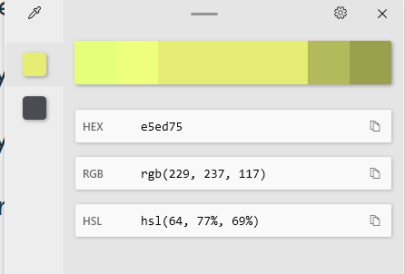

# Valorant Kill/Death/Assist timeframe getter

A program designed to process your valorant recordings and figure out the timestamps of your duels for efficient analysis.  
Uses OpenCV to analyze the HSV of the "user mark" in kill banners to find duel timestamps.   

Runtime: 27 minute recording took 70 seconds to finish processing.  

# Running the program

### Prerequisites
- [OpenCV](https://opencv.org/releases/)
- [Python3](https://www.python.org/downloads/) 

Clone the repo, and copy the path to your recording.  
Open up opencvtest.py in an editor and edit the path to the recorded video.   
Navigate to `replay-timestamps` directory.  
`$> python3 opencvtest.py`

Example output: 
```
PS C:\Users\Admin\projects\replay-timestamps> python3 opencvtest.py
00_02_03
00_03_00
00_03_03
00_03_21
00_03_24
00_04_36
00_06_45
00_08_06
00_10_09
00_11_03
00_11_42
00_12_54
00_12_57
00_13_18
00_14_12
00_15_33
```


# Intro / Motivation
As a casual player, I've noticed I hit a huge wall in progression and had trouble improving.  
I started recording my gameplay. Without the heat of the moment or stress it becomes easier to spot the flaws in your gameplay as a spectator. 

For an average of 35-45 minute game, each interaction/duel usually lasts 3 seconds and the key moments of gameplay rewatch are in the seconds leading up to it. Since what we need is about 10 - 15 seconds of duels and assuming average players drop 17 kills in a game, that's only 4.5 minutes of total gameplay we want to watch. 
To have to comb through to find the timestamps of all my duels were provided further friction from wanting to watch the replays and analyze. 

With the lack of replay system in Valorant currently May 2022, recording your own gameplay via third party software is the most common method. 

I didn't want to sift through the entire clip and wanted this extra time commitment to be efficient. 

# Progress 

I found the best framework to parse video to be [OpenCV](https://opencv.org/). 

The plan is as follows. Valorant has a kill banner for every kill/death interaction in the game. 
Luckily for us, the game highlights the player's interactions with yellow.   


By focusing on the region of kill banners, checking for the specific banner color every x seconds, we can extract the timeframes of when these duels were happening. 

I found each banner lasts for exactly 4 seconds. Meaning if we can parse the video for every 3 seconds (skip 3 seconds worth of frame for 60fps video), we'll be able to cut processing time and still be able to catch the kill banner before it dissapears. 

### Getting the timestamps
The code uses a counter variable to skip the video every 180 frames. Assuming our recording against the program is in 60 fps, this skips 3 seconds. By dividing the counter variable by 60, we can easily get what second of the video we're on and use the python strftime() to convert it into the timestamp we can use for the user to find on the video itself. 

    timestamp = time.strftime('%H_%M_%S', time.gmtime(count //  60))


## Identifying relevant frames 
### resizing the image
The only thing we care about is the kill banner with the yellow highlight. 
I started by using the selectROI to get the kill banner region coordinates. 
This allows us to resize every frame into just the kill banner for processing. 

    im = cv2.imread("images\\frame4560.jpg")
    print(im) # --> returns (1967, 5, 584, 377)
    roi = cv2.selectROI(im) # (1967, 5, 584, 377)
    # image = image[c1:c1+25,r1:r1+25]
    image = image[5:377+5, 1967: 1967 + 584] # resize frame into selected region

Since `cv2.selectROI(im)` is a manual user operation in which the program is paused and allows user to draw their own rectangle region, I've used it initially to collect the coordinates and hardcoded the values for the regions. 
* NOTE: Assuming every recording is capped at 2000. If this is not the case, we'll have to find a better way to dynamically get the regions. 


### Detecting kill color in our image 

This was the color value we wanted to isolate for the user mark. 




Using this basic_color_separator repo (https://github.com/twenty-twenty/opencv_basic_color_separator)

I was able to get as close to the proper HSV values I wanted. (Despite the HSL values above, I realized HSV != HSL)


After getting the HSV values, create a mask using it. Now we can check if a duel occurred. 

    img = cv2.imread("images\\valotest.jpg")
    hsv = cv2.cvtColor(img, cv2.COLOR_BGR2HSV)

    lower_val = np.array([27, 47, 187]) 
    upper_val = np.array([41, 135, 255])

    # Threshold the HSV image - any yellow color will show up as white
    mask = cv2.inRange(hsv, lower_val, upper_val)
    # if there are any white pixels on mask, sum will be > 0
    hasYellow = np.sum(mask)
    if hasYellow > 0:
        print('Duel detected!')

By playing around with tighter HSV values and ROI (region of interest in image for OpenCV code to analyze), I was able to bring up the success rate to roughly 95% success rate. 

Here's a successfully matched frame in action: 


## Problems 

Here's the limitations of attempting to find the timestamps via HSV values. 
- The kill banner lengths are dependent on name length. Since the user mark we check the HSV for is at the edges of the banner, we need to account for longer usernames and keep our ROI wider than ideal. 
    - One workaround to this would be to have the user turn off multiplayer user names off. Showing only the agent names which are limited to one word.

-   Agent skill effects. There are at least two agent skill vfx that cause the edges of our screen to light up yellow. Because the HSV values are similar enough and the nature of 3D game has us move our camera constantly, the program detects the HSV value we set for the user mark in frames with the skill VFX instead. This is the biggest issue with trying to find the timestamps via HSV analysis. (Fig 1)

Fig1 false positive due to agent skill vfx: 


## Solution

With the use of Riot API (that's not available to the public like me...), we'll be able to get timestamps of each duel and calculate the proper timestamps for a 100% success rate. 


# References 

skip frames: https://stackoverflow.com/questions/22704936/reading-every-nth-frame-from-videocapture-in-opencv  
second to hms conversion: https://stackoverflow.com/questions/1384406/convert-seconds-to-hhmmss-in-python  
selecting roi: https://stackoverflow.com/questions/15424852/region-of-interest-opencv-python  
selecting roi: https://www.youtube.com/watch?v=bxd96VKJ4lM

detecting color: https://opencv24-python-tutorials.readthedocs.io/en/latest/py_tutorials/py_imgproc/py_colorspaces/py_colorspaces.html  
detecting colors: https://stackoverflow.com/questions/58288014/how-to-know-if-a-color-is-detected-on-opencv
