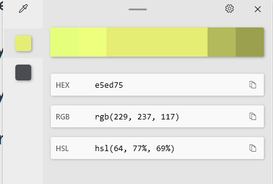

# Valorant Kill/Death/Assist timeframe getter

# intro 
Ever since I hit Platinum rank in Valorant, I started facing a huge wall and rise in difficulty. 
No matter what I did it felt like the opponents were on another level than me. 
Good games were rare, most games were won by my teammates, etc/ //..

I started recording my gameplay. Without the heat of the moment, stress it becomes easier to spot the flaws in your gameplay as a spectator. 

But the problem is when you're focused on your own gameplay and interactions with the enemy, the game is too long.
For an average of 35-45 minute game, each interaction/duel usually lasts 3 seconds and the key moments of gameplay rewatch are in the seconds leading up to it. Since what we need is about 10 - 15 seconds of duels and assuming average players drop 17 kills in a game, that's only 4.5 minutes of total gameplay we want to watch. 

With the lack of replay system in Valorant currently May 2022, recording your own gameplay via third party software is the most common method. 

I didn't want to sift through the entire clip and wanted this extra time commitment to be efficient. 

# progress 

I found the best framework to parse video to be [OpenCV](https://opencv.org/). 

The plan is as follows. Valorant has a kill banner for every kill/death interaction in the game. 
Luckily for us, the game highlights the player's interactions with yellow. 

By focusing on the region of kill banners, checking for the specific banner color every x seconds, we can extract the timeframes of when these duels were happening. 

I found each banner lasts for exactly 4 seconds. Meaning if we can parse the video for every 3 seconds, we'll be able to save processing time and still be able to catch the kill banner before it dissapears. 

### Getting the timestamps
The code uses a counter variable to skip the video every 180 frames. Assuming our recording against the program is in 60 fps, this skips 3 seconds. By dividing the counter variable by 60, we can easily get what second of the video we're on and use the python strftime() to convert it into the timestamp we can use for the user to find on the video itself. 

    timestamp = time.strftime('%H_%M_%S', time.gmtime(count //  60))

## Identifying relevant frames 
### resizing the image
The only thing we care about is the kill banner with the yellow highlight. 
I started by using the selectROI to get the kill banner region coordinates. 
This allows us to resize every frame into just the kill banner for processing. 

    im = cv2.imread("images\\frame4560.jpg")
    print(im) # --> returns (1967, 5, 584, 377)
    roi = cv2.selectROI(im) # (1967, 5, 584, 377)
    # image = image[c1:c1+25,r1:r1+25]
    image = image[5:377+5, 1967: 1967 + 584] # resize frame into selected region

Since `cv2.selectROI(im)` is a manual user operation in which the program is paused and allows user to draw their own rectangle region, I've used it initially to collect the coordinates and hardcoded the values for the regions. 
* NOTE: Assuming every recording is capped at 2000. If this is not the case, we'll have to find a better way to dynamically get the regions. 

### detecting kill color in our image 

Value: 
used this : https://github.com/twenty-twenty/opencv_basic_color_separator

to get the HSV values to try . 

After getting the HSV values, create a mask using it. Now we can check  if a duel occurred. 

    img = cv2.imread("images\\valotest.jpg")
    hsv = cv2.cvtColor(img, cv2.COLOR_BGR2HSV)

    lower_val = np.array([27, 47, 187]) 
    upper_val = np.array([41, 135, 255])

    # Threshold the HSV image - any yellow color will show up as white
    mask = cv2.inRange(hsv, lower_val, upper_val)
    # if there are any white pixels on mask, sum will be > 0
    hasYellow = np.sum(mask)
    if hasYellow > 0:
        print('Duel detected!')

Problem : KillJoy Character is similar to yellow and shows up. / Background unexpectedly bright and mess up mask. 
Workaround : Two masks. One for the kill highlight yellow color. Second for green (ally team) color? -> won't work. Killjoy ally will have yellow and green HSV.
 

Limiting the Region of Interest to be tighter & checking if value of mask.sum is significant --> reduced false positives by 97%. 
TODO ;

# random 

for crosshair placement processing? https://www.geeksforgeeks.org/python-process-images-of-a-video-using-opencv/ 
what if we process it and get simple lines. see how close said lines are to our crosshair coordinates. 
Run frames to see how good it stays put. 

we can test this with noob gameplay vs pro gameplay (alive round gameplay to ignore spectators) and see if value is accurate. 

# references 

skip frames: https://stackoverflow.com/questions/22704936/reading-every-nth-frame-from-videocapture-in-opencv
second to hms conversion: https://stackoverflow.com/questions/1384406/convert-seconds-to-hhmmss-in-python
selecting roi: https://stackoverflow.com/questions/15424852/region-of-interest-opencv-python
selecting roi: https://www.youtube.com/watch?v=bxd96VKJ4lM

detecting color: https://opencv24-python-tutorials.readthedocs.io/en/latest/py_tutorials/py_imgproc/py_colorspaces/py_colorspaces.html
detecting colors: https://stackoverflow.com/questions/58288014/how-to-know-if-a-color-is-detected-on-opencv